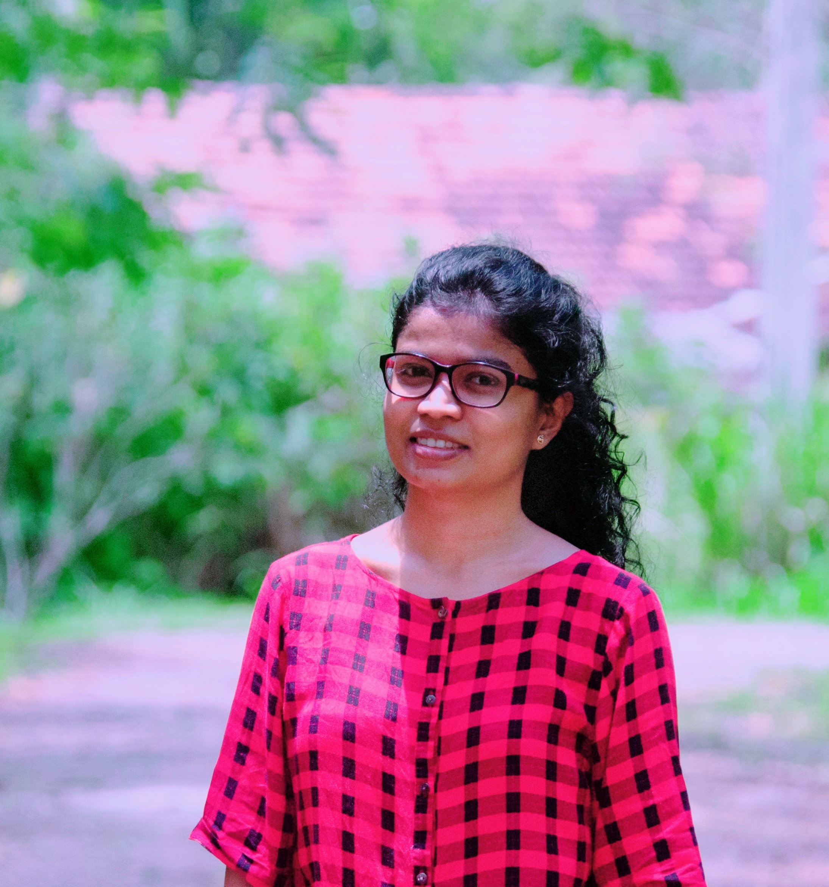

# Hello, I'm Nethmi 👋

I’m a first-year graduate student at the University of Idaho. I hold a BSc (Hons) in Industrial Mathematics from Rajarata University of Sri Lanka, where I studied Mathematics, Computer Science, and Chemistry.

I'm passionate about applied mathematics, data analysis, and scientific research.

  <a href="research.md" style="display:inline-block; padding:10px 20px; margin:5px; background:#6a0dad; color:white; text-decoration:none; border-radius:6px;">🔬 Research</a>
  <a href="teaching.md" style="display:inline-block; padding:10px 20px; margin:5px; background:#6a0dad; color:white; text-decoration:none; border-radius:6px;">👩‍🏫 Teaching</a>
  <a href="contact.md" style="display:inline-block; padding:10px 20px; margin:5px; background:#6a0dad; color:white; text-decoration:none; border-radius:6px;">📬 Contact</a>

  [🔬 Research](research.md)
  [👩‍🏫 Teaching](teaching.md)
  [📬 Contact](contact.md)
  [📸 Photos](photos.md)
  [📄 Download My CV](assets/Nethmi_Herath_CV.pdf)

Here are a few snapshots from my academic journey.  
[See full gallery →](photos.md)

[📄 Download My CV](assets/Nethmi_Herath_CV.pdf){:target="_blank"}
